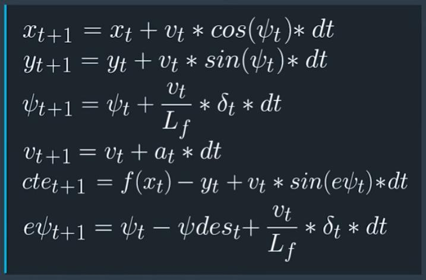

# Self-Driving Car Engineer - Model Predictive Control Project

---

In this project we navigate a track in the [Udacity Term 2 Simulator](https://github.com/udacity/self-driving-car-sim/releases). 


The simulator sends the telemetry and track waypoint data back to the controller via websocket and the controller sends the steering and acceleration commands to the simulator. The solution must handle 100ms latency as could be encountered in the actual application. This project makes use of the IPOPT and CPPAD libraries to calculate the optimal trajectory and the actuation commands in order to minimize the error with a third-degree polynomial fit to the given waypoints. The controller uses an optimizer which uses a kinematic model of the vehicle to minimize the cost function which penalizes the cross-track error, heading angle and other factors for smooth and effective following of the upcoming (few) waypoints.


## Dependencies

* cmake >= 3.5
 * All OSes: [click here for installation instructions](https://cmake.org/install/)
* make >= 4.1(mac, linux), 3.81(Windows)
  * Linux: make is installed by default on most Linux distros
  * Mac: [install Xcode command line tools to get make](https://developer.apple.com/xcode/features/)
  * Windows: [Click here for installation instructions](http://gnuwin32.sourceforge.net/packages/make.htm)
* gcc/g++ >= 5.4
  * Linux: gcc / g++ is installed by default on most Linux distros
  * Mac: same deal as make - [install Xcode command line tools]((https://developer.apple.com/xcode/features/)
  * Windows: recommend using [MinGW](http://www.mingw.org/)
* [uWebSockets](https://github.com/uWebSockets/uWebSockets)
  * Run either `install-mac.sh` or `install-ubuntu.sh`.
  * If you install from source, checkout to commit `e94b6e1`, i.e.
    ```
    git clone https://github.com/uWebSockets/uWebSockets
    cd uWebSockets
    git checkout e94b6e1
    ```
    Some function signatures have changed in v0.14.x. See [this PR](https://github.com/udacity/CarND-MPC-Project/pull/3) for more details.

* **Ipopt and CppAD:** Please refer to [this document](https://github.com/udacity/CarND-MPC-Project/blob/master/install_Ipopt_CppAD.md) for installation instructions.
* [Eigen](http://eigen.tuxfamily.org/index.php?title=Main_Page). This is already part of the repo so you shouldn't have to worry about it.
* Simulator. You can download these from the [releases tab](https://github.com/udacity/self-driving-car-sim/releases).
* Not a dependency but read the [DATA.md](./DATA.md) for a description of the data sent back from the simulator.


## Basic Build Instructions

1. Clone this repo.
2. Make a build directory: `mkdir build && cd build`
3. Compile: `cmake .. && make`
4. Run it: `./mpc`.


## Project Instructions and Rubric

Note: regardless of the changes you make, the project must be buildable using
cmake and make!

####* Model: 
The kinematic model provides the x and y coordinates, heading angle, velocity, cross-track error and heading angle error as shown below - 



####* Timestep length and elapsed duration (N & dt): 
The chosen values for N and dt are 10 and 0.1 respectively which were suggested in the starter code. These values imply that the controller is optimizing over a horizon of 1 second descretized by 10 points. Several other value pairs were tested but these values produced the best results.

####* Polynomial fitting and MPC processing:
The waypoints are transformed to the vehicle coordinates (lines 63 to 68 in main.cpp) which simplifies the fitting process as the fitting then starts at vehilce x & y origin (0, 0) and heading angle is zero.

####* Model predictive control with latency:
The kinematic model includes the actuator values from the previous timestep but with a delay of 100ms the actuator inputs are applied another timestep later. This is included in lines 104 to 107 in MPC.cpp.


